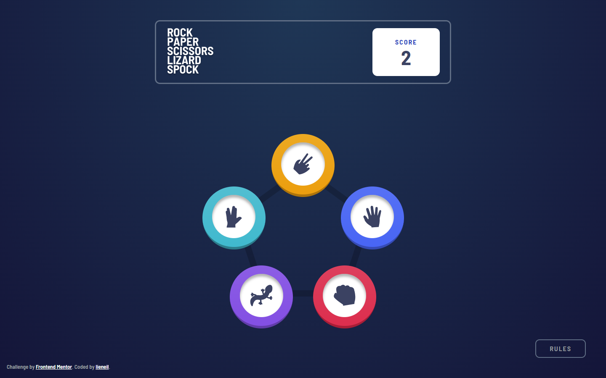

# Frontend Mentor - Rock, Paper, Scissors solution

This is a solution to the [Rock, Paper, Scissors challenge on Frontend Mentor](https://www.frontendmentor.io/challenges/rock-paper-scissors-game-pTgwgvgH). Frontend Mentor challenges help you improve your coding skills by building realistic projects. 

## Table of contents

- [Overview](#overview)
  - [The challenge](#the-challenge)
  - [Screenshot](#screenshot)
  - [Links](#links)
- [My process](#my-process)
  - [Built with](#built-with)
  - [What I learned](#what-i-learned)
  - [Useful resources](#useful-resources)

## Overview

### The challenge

Users should be able to:

- View the optimal layout for the game depending on their device's screen size
- Play Rock, Paper, Scissors against the computer
- Maintain the state of the score after refreshing the browser _(optional)_
- **Bonus**: Play Rock, Paper, Scissors, Lizard, Spock against the computer _(optional)_

### Screenshot

### Links

- [Live Demo](https://njvs.github.io/Rock-Paper-Scissors-Lizard-Spock/)
- [FontendMentor Solution](https://www.frontendmentor.io/solutions/rock-paper-scissor-lizard-spock-OqBM3Ujnf7)

### Built with

- Semantic HTML5 markup
- CSS custom properties
- Javascript
- [SASS/SCSS](https://sass-lang.com) - CSS preprocessor
- Flexbox
- Responsive Web Design

### What I learned

Game logic is pretty easy tbh. What I find difficult is the animations, I'm not sure if it's better to just use CSS keyframes animation, but it works so yeah. Ill go back to this project someday to clean it up and try using keyframes instead of transitions.

### Useful resources

- [A Complete Guide to Flexbox](https://css-tricks.com/snippets/css/a-guide-to-flexbox/)
- [A Complete Guide to Grid](https://css-tricks.com/snippets/css/complete-guide-grid/)
- [An opinionated styleguide for writing sane, maintainable and scalable Sass.](https://sass-guidelin.es/)